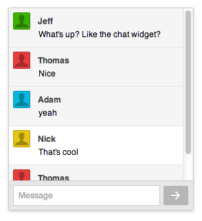

[](https://travis-ci.org/goinstant/chat)

## [Chat](https://developers.goinstant.com/v1/widgets/chat.html)

--------- Intro ----------



You can learn more in our
[guides](https://developers.goinstant.com/v1/widgets/guides/index.html),
and
[documentation](https://developers.goinstant.com/v1/widgets/chat.html).

Have questions? We're on IRC. #goinstant on [Freenode](http://freenode.net/).

## Packaging
For your convenience, we've packaged the Chat widget in several
ways.

#### Using our CDN

We host a copy on our CDN. Have a look at the [docs](https://developers.goinstant.com/v1/widgets/chat.html)
to see how to reference those files, as well as how to initialize the component.

#### How do I build the script myself?

You may have your own build process. We've tried to make it easy to include
the Chat widget in your build process.

#### Bower

We've packaged the Chat widget as a [bower](http://bower.io/)
component.

```
bower install goinstant-chat
```

#### Component

We've packaged the Chat widget as a [component](http://component.io/).

```
component install goinstant/chat
```

## Contributing

### Development Dependencies

- [node.js](http://nodejs.org/) >= 0.8.0
- [grunt-cli installed globally](http://gruntjs.com/getting-started)
  - `npm install -g grunt-cli`

### Set-Up

The following assumes that you have already installed the dependencies above.

```
git clone https://github.com/goinstant/chat.git
cd chat
npm install
```

#### Building Chat for Development

The Chat widget is built as a [component](https://github.com/component/component).
Feel free to manually install dependencies and build using the `component`
command line tool.

For convenience, we've included a simple grunt command for installing
component dependencies and building:

```
grunt build
```

If this command runs succesfully you'll now have `components` and `build`
directories in your Git repo root.

### Running Tests

Tests are written in [mocha](http://visionmedia.github.io/mocha/). They're run
in an [HTML file](http://visionmedia.github.io/mocha/#html-reporter).

Just open the test/index.html file to run the tests.

On Mac OS, you can just run this command to open the HTML Runner in your
default browser:

```
open test/index.html
```

### Running Examples

This will open up an example of Chat at work, using your local
build.

You should have run `grunt build` already.

#### 1. Copy the example config.

```
cp config/config.example.js config/config.js
```

#### 2. Replace the connectUrl with your GoInstant application's connectUrl.

If you haven't signed up for GoInstant yet, you can [sign up and create an
application here](https://goinstant.com/signup).

After you have an application's `connectUrl`, set inside of config.js:

##### config.js

```js
window.config = {
  connectUrl: 'https://goinstant.net/YOUR_ACCOUNT/YOUR_APP',
  room: 'goinstant-widget-examples'
};
```

#### 3. Open the example index and click an example.

```
open examples/index.html
```
